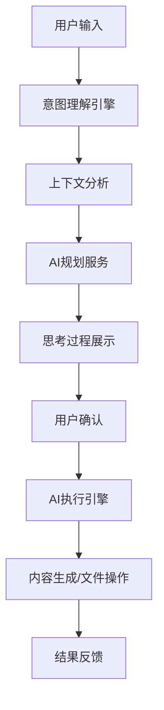

# 🧠 ScholarFlow - AI驱动的科研写作助手

<div align="center">


**让AI成为你的科研写作伙伴，而不是工具**

[](https://opensource.org/licenses/MIT)
[](https://www.typescriptlang.org/)
[](https://reactjs.org/)
[](https://vitejs.dev/)

</div>

## 🎯 产品愿景

ScholarFlow 是一个**AI驱动的科研写作助手**，灵感来源于 Cursor 的协作式AI体验。我们相信AI应该成为你的**科研写作伙伴**，而不仅仅是工具。

### ✨ 核心特性

- 🤖 **智能对话引擎** - 自然语言交互，理解你的写作意图
- 📝 **自动内容生成** - AI自动生成论文大纲、章节内容、引用建议
- 🧠 **思考过程可视化** - 像Cursor一样展示AI的思考过程和执行计划
- 📊 **上下文感知** - 理解文档结构、研究领域和写作进度
- 🔄 **主动建议** - AI主动检测问题并提供改进建议
- 📁 **文件管理** - 智能文件树和版本控制
- 🎨 **现代UI** - 美观的界面设计，支持LaTeX和富文本编辑

## 🚀 快速开始

### 环境要求

- Node.js 18+ 
- npm 或 yarn
- OpenAI API Key

### 安装步骤

1. **克隆仓库**
```bash
git clone https://github.com/MJXWANG/ScholarFlow.git
cd ScholarFlow
```

2. **安装依赖**
```bash
npm install
```

3. **配置环境变量**
```bash
# 复制环境变量模板
cp env.example .env

# 编辑 .env 文件，添加你的 OpenAI API Key
VITE_OPENAI_API_KEY=your_openai_api_key_here
```

4. **启动开发服务器**
```bash
npm run dev
```

5. **打开浏览器**
访问 `http://localhost:5173`

## 🎨 功能演示

### 智能对话体验

```
用户: "帮我写一篇关于深度学习的论文大纲"

AI: 🧠 正在分析你的需求...
    📋 已制定执行计划: 生成学术论文大纲
    ✅ 计划执行完成!
    
    📝 生成的大纲内容：
    
    # 深度学习研究论文大纲
    
    ## 1. 引言 (Introduction)
    ### 1.1 研究背景
    - 人工智能的发展历程
    - 深度学习的兴起
    - 当前研究现状
    
    ### 1.2 研究动机
    - 传统机器学习方法的局限性
    - 深度学习的技术优势
    - 实际应用需求
    
    ...
```

### AI思考过程展示

```
🧠 AI思考过程:
├── 分析: 用户需要深度学习论文大纲
├── 计划: 
│   ├── 1. 分析论文主题 ✅
│   ├── 2. 生成论文大纲 ✅  
│   ├── 3. 创建文档文件 ✅
│   ├── 4. 插入大纲内容 ✅
│   └── 5. 保存文档 ✅
├── 风险评估: 无重大风险
└── 替代方案: 可提供模板选择
```

## 🏗️ 技术架构

### 前端技术栈

- **React 18** - 现代化UI框架
- **TypeScript** - 类型安全的JavaScript
- **Vite** - 快速构建工具
- **Tailwind CSS** - 实用优先的CSS框架
- **Zustand** - 轻量级状态管理

### AI服务架构

- **OpenAI GPT-4** - 核心AI能力
- **意图理解引擎** - 解析用户自然语言输入
- **上下文感知系统** - 理解文档和项目状态
- **AI规划服务** - 生成执行计划和思考过程
- **主动建议系统** - 检测问题并提供改进建议

### 🧠 核心AI工作流程



### 🔧 关键服务说明

#### 1. 意图理解服务 (`intentUnderstandingService.ts`)
- **作用**: 将自然语言转换为结构化意图
- **输入**: 用户文本 + 文档上下文
- **输出**: 意图类型 + 目标 + 参数
- **关键方法**: `parseUserIntent()`, `generateAIResponse()`

#### 2. AI规划服务 (`aiPlanningService.ts`)
- **作用**: 生成AI的思考过程和执行计划
- **特点**: 像Cursor一样展示"AI在想什么"
- **关键方法**: `analyzeAndPlan()`, `executePlanStep()`

#### 3. AI执行引擎 (`aiExecutionEngine.ts`)
- **作用**: 执行AI生成的具体操作
- **支持操作**: 创建文件、插入内容、保存文档
- **关键方法**: `executeActions()`

#### 4. 智能对话组件 (`SmartConversation.tsx`)
- **作用**: 主要的AI交互界面
- **功能**: 显示对话历史、AI思考过程、执行计划
- **状态管理**: 通过 `aiStore.ts` 管理

### 核心组件

```
src/
├── components/           # UI组件
│   ├── AIAssistant.tsx  # AI助手主界面
│   ├── SmartConversation.tsx # 智能对话组件
│   ├── AIPlanningPanel.tsx   # AI规划面板
│   ├── Editor.tsx       # 编辑器组件
│   └── FileTree.tsx     # 文件树组件
├── services/            # 服务层
│   ├── aiService.ts     # AI服务接口
│   ├── intentUnderstandingService.ts # 意图理解
│   ├── aiPlanningService.ts # AI规划服务
│   └── aiExecutionEngine.ts  # AI执行引擎
└── store/              # 状态管理
    ├── aiStore.ts       # AI状态
    ├── fileSystemStore.ts # 文件系统状态
    └── projectStore.ts  # 项目状态
```

## 🎯 使用场景

### 📚 学术论文写作
- 自动生成论文大纲
- 智能内容扩展
- 引用格式检查
- 语言润色

### 📖 研究报告
- 结构化内容组织
- 图表建议
- 参考文献管理
- 格式标准化

### 📝 技术文档
- 代码注释生成
- API文档编写
- 用户手册制作
- 技术规范制定

## 🔧 配置说明

### 环境变量

```bash
# OpenAI API配置
VITE_OPENAI_API_KEY=your_openai_api_key_here

# 应用配置
VITE_APP_NAME=ScholarFlow
VITE_APP_VERSION=1.0.0
```

### API密钥获取

1. 访问 [OpenAI Platform](https://platform.openai.com/)
2. 创建账户并获取API密钥
3. 将密钥添加到`.env`文件中
4. 确保账户有足够的API使用额度

## 📊 项目状态

### ✅ 已完成功能

- [x] 智能对话引擎
- [x] AI内容生成（大纲、章节）
- [x] 思考过程可视化
- [x] 上下文感知系统
- [x] 文件管理系统
- [x] LaTeX编辑器集成
- [x] 现代UI界面

### 🚧 开发中功能

- [ ] 多模态AI理解（图表、公式）
- [ ] 协作功能
- [ ] 期刊格式适配
- [ ] 引用管理集成
- [ ] 版本控制增强

### 📋 计划功能

- [ ] 团队协作
- [ ] 云端同步
- [ ] 移动端支持
- [ ] 插件系统
- [ ] 多语言支持

## 👨‍💻 开发指南

### 🎯 项目理解要点

**对于新开发者（包括使用Cursor的开发者）:**

1. **产品定位**: 这是一个"Cursor式"的AI科研写作助手
   - 不是传统的AI工具，而是AI协作者
   - 重点在于自然语言交互和AI思考过程可视化

2. **核心技术栈**: React + TypeScript + Vite + Zustand
   - 状态管理使用Zustand（轻量级Redux替代）
   - UI使用Tailwind CSS
   - AI服务基于OpenAI GPT-4

3. **关键架构模式**:
   - **服务层**: `src/services/` - 处理AI逻辑和外部API
   - **状态层**: `src/store/` - Zustand状态管理
   - **组件层**: `src/components/` - React UI组件

### 🔍 代码结构解析

#### 核心AI流程
```
用户输入 → 意图理解 → AI规划 → 思考展示 → 用户确认 → 执行操作
```

#### 关键文件说明
- `src/services/intentUnderstandingService.ts` - AI的"大脑"，理解用户意图
- `src/services/aiPlanningService.ts` - AI的"规划师"，生成执行计划
- `src/services/aiExecutionEngine.ts` - AI的"执行器"，执行具体操作
- `src/components/SmartConversation.tsx` - 主要的AI交互界面
- `src/store/aiStore.ts` - AI相关的状态管理

### 🚀 快速开发指南

#### 1. 环境设置
```bash
# 克隆项目
git clone https://github.com/MJXWANG/ScholarFlow.git
cd ScholarFlow

# 安装依赖
npm install

# 配置环境变量
cp env.example .env
# 编辑 .env 文件，添加 OpenAI API Key

# 启动开发服务器
npm run dev
```

#### 2. 开发调试
- **AI功能测试**: 在浏览器中打开AI助手，输入"帮我生成论文大纲"
- **状态调试**: 使用React DevTools查看Zustand状态
- **API调试**: 检查浏览器控制台的API调用日志

#### 3. 常见开发任务

**添加新的AI功能:**
1. 在 `intentUnderstandingService.ts` 中添加新的意图类型
2. 在 `aiPlanningService.ts` 中添加对应的执行步骤
3. 在 `aiExecutionEngine.ts` 中实现具体操作
4. 在 `SmartConversation.tsx` 中添加UI展示

**修改AI响应:**
- 编辑 `intentUnderstandingService.ts` 中的prompt模板
- 调整 `aiPlanningService.ts` 中的思考过程生成逻辑

**添加新的UI组件:**
- 在 `src/components/` 中创建新组件
- 使用Tailwind CSS进行样式设计
- 通过Zustand store管理状态

### 🛠️ 使用Cursor进行开发

**Cursor AI助手可以帮你:**

1. **理解代码结构**: 
   - "解释这个项目的AI工作流程"
   - "这个组件的作用是什么？"

2. **快速开发**:
   - "帮我添加一个新的AI功能：自动生成参考文献"
   - "修改AI的响应格式，让它更友好"

3. **调试问题**:
   - "为什么AI没有生成内容？"
   - "帮我修复这个TypeScript错误"

4. **代码优化**:
   - "优化这个组件的性能"
   - "重构这个服务，让它更模块化"

### 📝 开发规范

- **TypeScript**: 严格类型检查，避免 `any` 类型
- **组件设计**: 单一职责，可复用
- **状态管理**: 使用Zustand，避免过度嵌套
- **AI服务**: 错误处理要完善，用户体验要友好
- **代码注释**: 关键逻辑要有中文注释

## 🤝 贡献指南

我们欢迎所有形式的贡献！

### 如何贡献

1. Fork 这个仓库
2. 创建你的特性分支 (`git checkout -b feature/AmazingFeature`)
3. 提交你的更改 (`git commit -m 'Add some AmazingFeature'`)
4. 推送到分支 (`git push origin feature/AmazingFeature`)
5. 打开一个 Pull Request

### 开发规范

- 使用 TypeScript 进行类型安全开发
- 遵循 ESLint 和 Prettier 配置
- 编写清晰的提交信息
- 添加适当的测试用例

## 📄 许可证

本项目采用 MIT 许可证 - 查看 [LICENSE](LICENSE) 文件了解详情。

## 🙏 致谢

- [OpenAI](https://openai.com/) - 提供强大的AI能力
- [Cursor](https://cursor.sh/) - 灵感来源
- [React](https://reactjs.org/) - 优秀的UI框架
- [Vite](https://vitejs.dev/) - 快速的构建工具

## 📞 联系我们

- 项目链接: [https://github.com/MJXWANG/ScholarFlow](https://github.com/MJXWANG/ScholarFlow)
- 问题反馈: [Issues](https://github.com/MJXWANG/ScholarFlow/issues)
- 功能建议: [Discussions](https://github.com/MJXWANG/ScholarFlow/discussions)

---

<div align="center">

**让AI成为你的科研写作伙伴** 🚀

Made with ❤️ by [MJXWANG](https://github.com/MJXWANG)

</div>